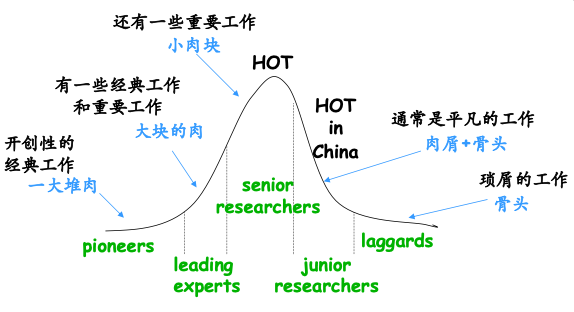

# 科研教程

这个项目是根据过往经验总结的从得到一个研究方向到论文写作与修改的一般流程。希望它能让你有更清晰的思路、更高的效率、更快的成长。
```
找一个好的样例非常重要！！！站在巨人的肩上！！！
找一个好的样例非常重要！！！站在巨人的肩上！！！
找一个好的样例非常重要！！！站在巨人的肩上！！！
```


## 选择研究方向
> 有时候选择的收益大于努力
### 初学者
选择到合适方向的重要途径是让导师更多的了解你，导师会结合团队和你个人情况选择研究方向


### 有经验者

**Remark**：几乎所有研究方向是有周期的，可以根据下图判断你是否可以在该领域持续3-5年时间。

## 论文综述
> 没经过Survey得到的问题可能是假的
#### 如何判定一篇论文的质量
该论文发表的期刊或会议大概率代表了该论文的水平及行业对论文的认可度，在拿到一篇论文时首先看这篇论文发表在那个地方，通过下面对应领域对该会议或期刊的评价考虑是否精读该论文：
- [CCF推荐国际学术刊物目录](https://www.ccf.org.cn/Academic_Evaluation/By_category/)
- [CSL@CQU Conference Journal Ranks](https://github.com/csl-cqu/Conference-Journal-Ranks)
- 知乎用户评价
- 相关中英博客
[如何收集和整理论文(面向CS专业)](https://ying-zhang.github.io/misc/2016-we-love-paper/)

#### 全面检索论文


Taxonomy样例：
- [Awesome Secure Collaborative Learning Papers](https://github.com/csl-cqu/Roubst-and-Privacy-preserving-Federated-Learning-System) (Markdown)
- [AdversarialNetsPapers](https://github.com/zhangqianhui/AdversarialNetsPapers)(Markdown)
- [Secure Distributed Learning/Federated Learning](https://docs.google.com/spreadsheets/d/1fzz5dXNo_PFWfoAo2OufYwRqOY4tzeLObm_sBMLpAso/edit?usp=sharing) (Sheets)


## 发现问题
> 有趣的灵魂万里挑一
#### 问题的价值和有趣性

#### 问题的可解决性
难度需适宜，如果你觉得问题太简单或太难了，说明这个问题还有待深入挖掘

## 测试平台（Benchmark）
> 现有Benchmark再有解决方案
> 没有Baselines也要自己造出一两个


## 解决方案
> Make Sense是核心
## 更多实验
> 重要程度：实验完整 > 解决方案花里胡哨
## 修改与完善
> 论文也要追求“美”
#### 写作注意事项

[PaperChecklist](https://github.com/csl-cqu/Paper-Checklist)


## 审稿与回复
> 写完论文的研究进程只算是走了70%

### 审稿

[Blind Review](https://github.com/csl-cqu/Blind-Review)


## 贡献
> 共享是计算机领域繁荣发展的重要因素

学习的原始动作是印随和模仿，本教程需要大量优秀的样例，希望老师和同学积极提供，造福更多学弟学妹。当然很多同学可能发现不了优秀样例中“优秀”的点，因此如果在提供优秀样例的同时提供一个差的版本供对比参照并会更有助于同学们的学习。